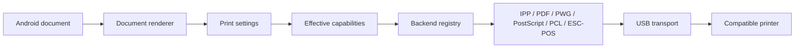

<p align="center">
  
</p>

# USB Print

**Direct USB printing for Android.**

USB Print is a local Android application that sends print jobs directly to compatible USB printers connected through USB Host / OTG. It uses standards-based protocols and printer-reported capabilities instead of a cloud service or vendor account.

No cloud. No account. No computer. No vendor print service.

[](https://developer.android.com/about/versions/oreo)
[](https://kotlinlang.org/)
[](app/build.gradle.kts)
[](https://developer.android.com/compose)
[](https://github.com/scholnik123/usb-print-android/releases/tag/v1.0.0)
[](https://github.com/scholnik123/usb-print-android/actions/workflows/android.yml)

> Printer compatibility depends on the protocol and command language implemented by the specific printer. Some host-based/GDI printers require a proprietary desktop driver and cannot be driven by this application.

## Download

Download the current APK from [GitHub Releases](https://github.com/scholnik123/usb-print-android/releases/latest).

The first public APK is debug-signed and intended for direct installation and testing. A production signing key is not included in this repository.

> **Development branch:** `codex/development` contains IPP PWG Raster Print-Job support completed after 1.0.0. It is not part of the published 1.0.0 APK and has not yet been validated on a physical printer.

## Features

- Direct USB Host / OTG printing with Android USB permission handling
- Automatic USB printer discovery and selection between multiple connected printers
- Capability-driven print settings with explicit source and confidence
- IPP-over-USB discovery and HTTP/IPP transport over USB bulk endpoints
- IPP Get-Printer-Attributes, direct PDF Print-Job, development IPP PWG Print-Job, short-lived job status polling, and Cancel-Job when reported
- PDF Direct, PWG Raster, PostScript Raster, PCL 5 Raster, ESC/POS, and raw printer-language passthrough
- PDF, image, and UTF-8 text rendering
- Foreground print jobs with notification cancellation
- Local presets, printer-specific experimental overrides, test-page generation, and redacted diagnostics export
- No cloud, account, advertising, analytics, Firebase, or INTERNET permission

## IPP-over-USB

USB Print detects a standards-compatible IPP-over-USB interface from USB descriptors. HTTP/1.1 and binary IPP are carried directly over USB bulk endpoints; Wi-Fi and Android network clients are not involved.

For compatible printers, the application can:

- read printer capabilities with Get-Printer-Attributes;
- build the settings UI from reported media, resolution, color, duplex, tray, media type, and output-bin values;
- send a PDF with Print-Job when both the operation and `application/pdf` are reported;
- on the development branch, render PDF/image/text into PWG Raster and submit it with one Print-Job when `image/pwg-raster`, a compatible raster type, resolution, and Print-Job are reported;
- query short-lived job status and send Cancel-Job when those operations are reported.

IPP PWG uses a unique, size-bounded file under the application cache to obtain an exact HTTP Content-Length. The file is removed after success, error, or cancellation, and abandoned spool files are cleaned at application startup. Copies and page selection are encoded once in the generated PWG document rather than repeated as IPP job attributes.

This is not a claim of full IPP Everywhere support. IPP PWG is a development capability with no physical-printer evidence yet. The Create-Job + Send-Document workflow is not implemented.

## Capability-driven printing

```text
Printer → discovered capabilities → backend capabilities
        → EffectivePrintCapabilities → settings UI → validated job
```

Unknown capabilities are not treated as supported. If a printer reports A4, 300 DPI, and monochrome, the application must not present A3, 1200 DPI, or color as confirmed options. IPP attributes such as `media-supported`, `printer-resolution-supported`, `sides-supported`, `print-color-mode-supported`, and `media-source-supported` feed the dynamic UI.

Legacy Printer Class devices use IEEE-1284 `CMD` detection plus clearly labelled backend defaults where required. A VID/PID or brand name alone never establishes compatibility.

## Print settings

- Copies
- All pages, page ranges, odd/even pages
- Reverse page order and collation where the backend supports them
- Paper size and portrait/landscape orientation
- Color, grayscale, and black-only modes
- Duplex when confirmed by the printer
- Exact printer resolution, including asymmetric IPP values
- Margins, fit/fill/actual/custom scale, and content positioning for raster paths
- Printer-reported media source, media type, and output bin for IPP backends
- Built-in and local custom presets

Available settings depend on the printer and selected backend. N-up is not presented because the compositor is not implemented.

## Printing backends

| Backend | Status | Typical use |
|---|---|---|
| IPP Direct PDF | Implemented | Direct PDF Print-Job through IPP-over-USB |
| IPP PWG Raster | Implemented on development branch | Software layout and PWG Raster Print-Job through IPP-over-USB |
| PDF Direct USB | Implemented | Unmodified PDF to a legacy printer that reports PDF |
| PWG Raster | Implemented | Rendered PDF/image/text for printers that report PWG Raster |
| PostScript Raster | Implemented subset | Level 2 rasterized pages for PostScript printers |
| PCL 5 Raster | Implemented subset | Monochrome raster output for printers that explicitly report PCL |
| ESC/POS | Implemented subset | Text and monochrome raster output for reported ESC/POS devices |
| RAW | Implemented | Unmodified PS/PCL data for a matching reported printer language |

Not currently implemented: Create-Job + Send-Document, PCLm, PCL XL/PCL6, URF, and vendor-specific GDI protocols.

See [BACKEND_MATRIX.md](BACKEND_MATRIX.md) for feature-level details.

## Supported documents

| Format | Handling |
|---|---|
| PDF | Direct or rendered, depending on printer and settings |
| JPEG / JPG | Rendered |
| PNG | Rendered |
| WEBP | Rendered |
| BMP | Rendered |
| TXT | UTF-8 text renderer with page planning |
| PS | Raw passthrough to a compatible PostScript printer |
| PCL / PRN | Raw passthrough to a compatible PCL printer |

DOC/DOCX, XLS/XLSX, PPT/PPTX, and HTML are not rendered. Convert Office documents to PDF before printing.

## How it works



The application never switches to another backend after transmission begins because an automatic retry could print the same job twice.

## Installation

1. Download the APK from [GitHub Releases](https://github.com/scholnik123/usb-print-android/releases/latest).
2. Allow installation from the download source if Android requests it.
3. Install USB Print.

Requirements:

- Android 8.0 / API 26 or later
- Android USB Host support
- A suitable USB OTG adapter or cable
- A compatible USB printer, with external power where required

## Quick start

1. Connect the printer through USB OTG.
2. Open USB Print.
3. Grant USB access.
4. Select or share a supported document.
5. Review the detected printer capabilities.
6. Configure the available print settings.
7. Start the print job.

`SENT` means the USB connection accepted the job bytes. It does not prove that the physical page was printed correctly.

## Privacy

- No account, analytics, Firebase, advertising, or cloud upload
- No INTERNET permission
- Documents are processed locally and sent directly to the connected USB printer
- Document contents, preview images, print payloads, and document URIs are not included in diagnostic exports
- Known serial-number fields are redacted from exported IEEE-1284 diagnostics

Review an export before posting it publicly and remove any private document or printer information that remains relevant to your environment.

## Building from source

Requirements: JDK 17 and Android SDK 35. Android Studio is optional.

Linux/macOS:

```bash
./gradlew testDebugUnitTest
./gradlew lintDebug
./gradlew assembleDebug
```

Windows:

```powershell
.\gradlew.bat testDebugUnitTest
.\gradlew.bat lintDebug
.\gradlew.bat assembleDebug
```

The APK is generated at `app/build/outputs/apk/debug/app-debug.apk`.

## Validation

The first public release passes 61 JVM tests covering IPP wire format and malformed input, HTTP framing, capability mapping, USB discovery, PWG/PCL/PostScript invariants, page planning, and raster memory calculations. The development branch passes 79 JVM tests after adding exact-length IPP PWG spooling, selection, MIME and payload checks, software copies/ranges, cancellation, cleanup, and failure-path coverage.

Internal golden/invariant tests are not equivalent to external validation through CUPS, Ghostscript, or ipptool, and they are not a substitute for physical printer testing. See [VALIDATION_REPORT.md](VALIDATION_REPORT.md) and [docs/TESTING.md](docs/TESTING.md).

## Limitations

- Compatibility depends on standards and command languages implemented by the printer.
- Host-based/GDI printers may require proprietary desktop drivers.
- No hardware-verified printers have been recorded for this release.
- IPP PWG is implemented only on the development branch and still lacks external reference-tool and physical-printer validation; Create-Job + Send-Document is not implemented.
- PCLm, PCL XL/PCL6, URF, and vendor-specific protocols are not implemented.
- N-up is not implemented.
- IPP custom-paper ranges may be detected, but custom-size UI and job encoding are incomplete.
- Office formats require conversion to PDF.
- The release APK is debug-signed, not production-signed.

## Compatibility reports

The hardware compatibility matrix starts empty by design. To report a real printer result, use the [printer compatibility issue form](https://github.com/scholnik123/usb-print-android/issues/new?template=printer_compatibility.yml) and attach redacted diagnostics. A successful USB transfer alone is not a confirmed print.

See [COMPATIBILITY.md](COMPATIBILITY.md) for evidence levels and the reporting table.

## Roadmap

- Physical printer validation and evidence-backed compatibility reports
- Physical-printer validation of the development IPP PWG Raster path
- Hardware-test confirmation and versioned printer profiles
- N-up composition
- Complete custom-paper workflow
- PCLm and expanded standards-based compatibility

No delivery dates are promised.

## Documentation

- [Architecture](docs/ARCHITECTURE.md)
- [Testing](docs/TESTING.md)
- [Print capabilities](PRINT_CAPABILITIES.md)
- [Backend matrix](BACKEND_MATRIX.md)
- [Compatibility](COMPATIBILITY.md)
- [Contributing](CONTRIBUTING.md)
- [Security](SECURITY.md)
- [Changelog](CHANGELOG.md)

## License

No open-source license has been selected yet. Without a `LICENSE` file, copyright law reserves all rights to the project owner. Review or use of the repository does not grant redistribution or modification rights beyond those provided by applicable law or GitHub's terms. Contributions should wait for the owner to select a license.
