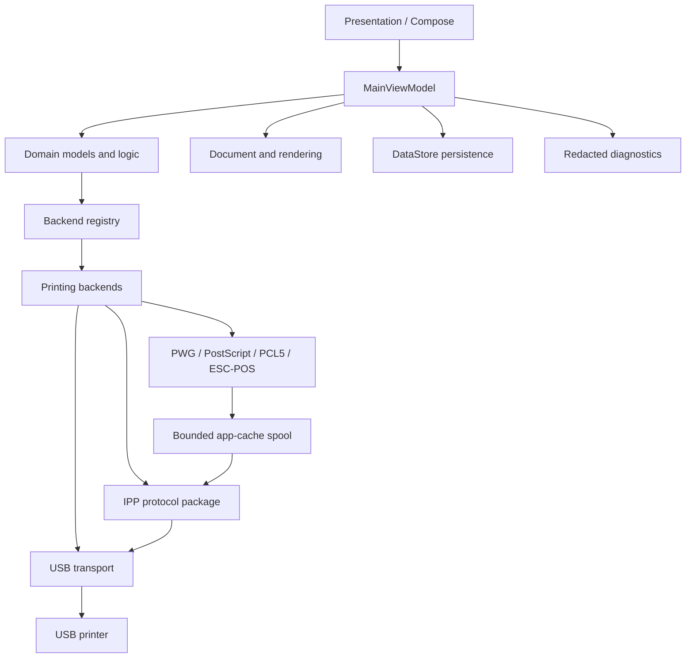
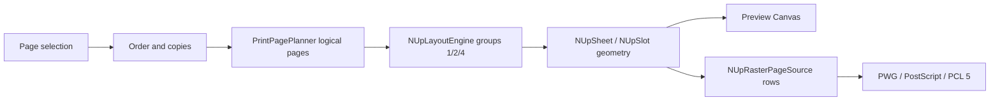
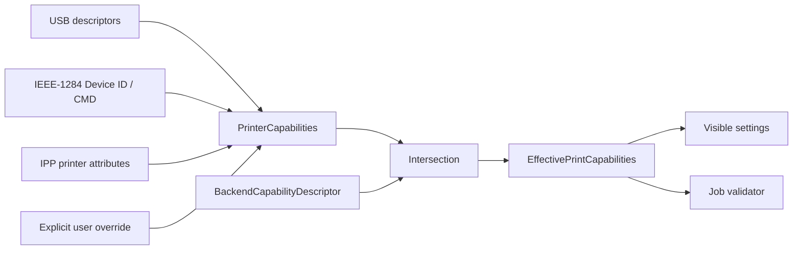
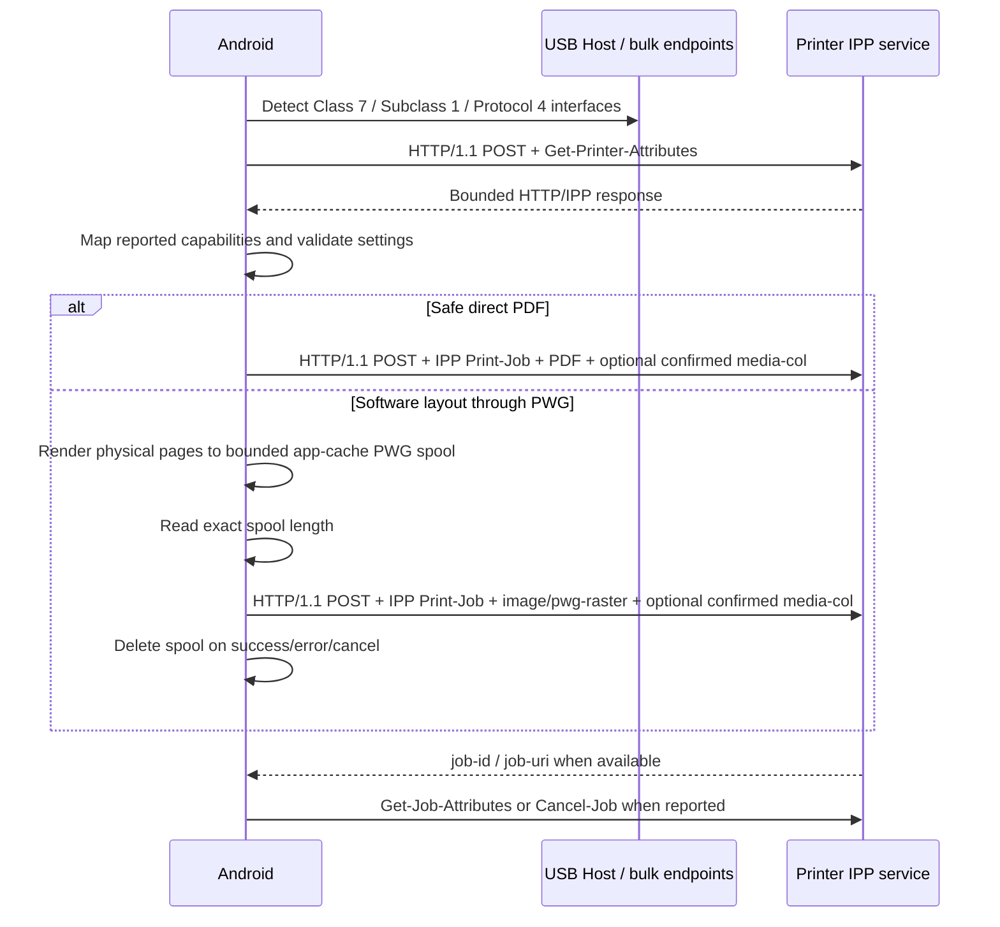

# Architecture

USB Print is a single-module Android application with boundaries between UI, domain decisions, document rendering, protocol encoders, IPP, and USB I/O. Protocol code does not depend on Compose, and transport interfaces can be replaced in deterministic tests.

## Architecture overview

## Packages and responsibilities

### Presentation

`MainActivity` and `presentation/` render USB state, preview, capability-driven settings, progress, diagnostics, and errors. Compose does not encode binary printer protocols.

### Domain

`domain/model/` contains documents, jobs, settings, exact custom-media micron values, printer capabilities, capability provenance, checked raster limits, and backend identifiers. `domain/logic/` validates settings, plans logical page order/copies, resolves presets, intersects capabilities, and chooses a backend before transmission.

### Document and rendering

`document/` reads user-selected `content://` URIs through the Storage Access Framework. PDF, images, and UTF-8 text expose a common `DocumentRenderer`. Large jobs are rendered one page at a time.

### Printing

`printing/` owns the foreground service, one-job store/executor, real-unit progress, bounded in-memory job metrics, physical page and N-up layout, raster memory policy, raster row composition, backend implementations, and protocol-specific pure encoders.

### IPP

`ipp/` contains binary models, encoder/decoder, bounded HTTP/1.1 framing, USB session, client operations, printer-capability mapping, and job-status mapping. It does not use Android network APIs.

### Protocols

IEEE-1284 parsing is isolated in `protocols/`. PWG Raster, PostScript, PCL 5, and ESC/POS encoders are in `printing/` and expose small testable framing functions.

### USB

`usb/` performs Printer Class and IPP-over-USB descriptor discovery, Android permission handling, Device ID and port-status queries, interface selection, endpoint transfer, and connection ownership.

### Persistence

`preferences/` stores local presets, advanced-mode state, printer-specific experimental overrides, and versioned hardware-test profiles in Jetpack DataStore. Presets and profiles preserve optional custom dimensions as exact microns. A profile retains bounded result history and a SHA-256 device identifier, never a raw serial or Android device key. Document contents and URIs are not persisted in printer preferences.

### Diagnostics

The in-memory diagnostic log is bounded to 200 entries and 500 characters per entry. A separate `PrintJobMetricsStore` retains the latest 20 jobs in the current process: prepare/render/encode/completed-USB-write/IPP-wait durations, generated/successfully written bytes, rendered logical pages, completed physical sheets, and peak tracked raster buffers. `MetricsUsbTransport` measures only completed transport writes; a failing transfer cannot expose an unknown partially accepted prefix through the current transport interface.

TXT/JSON diagnostics report protocol and capability state without including document content, preview images, filenames, document URIs, or print payloads. Known IEEE-1284 serial fields are redacted. Compatibility export is a separate schema built only from a saved profile and current Android version; it excludes even the stored identity hash and free-form notes. No metric or diagnostic record is uploaded automatically.

## Print pipeline

Only one job is active. A backend fallback is allowed during selection, before transmission. After any job bytes are sent, automatic fallback is forbidden to avoid duplicate physical output.

Progress events carry a phase plus an optional completed/total pair in bytes, logical pages, or physical sheets. A percentage is derived only from a known positive total. Preparation, IPP polling, and unknown-length streams remain indeterminate; no clock-driven progress is synthesized. Terminal `SENT` describes completion of the application's transfer workflow and does not prove physical output.

For composing raster backends, document pages take this additional path before protocol encoding:

The preview and output branches share `NUpSheet/NUpSlot`; only pixel resolution and the final renderer differ. Direct and passthrough backends bypass this composition and do not declare N-up support.

## Capability pipeline

Each printer-derived value carries `CapabilitySource` and `CapabilityConfidence`. An unknown value is not converted into confirmed support. Legacy raster defaults remain explicitly labelled backend defaults.

## IPP-over-USB path

IPP-over-USB requires USB bulk IN/OUT interfaces and does not require Wi-Fi or the Android `INTERNET` permission. The development path supports direct PDF and exact-length IPP PWG Print-Job. Create-Job + Send-Document remains future work.

Custom paper follows the same capability boundary as other IPP Job Template values. `IppPrinterCapabilitiesMapper` records the confirmed range and the exact `media-col-supported` member names. `BackendRegistry` exposes the UI only when `media-col/media-size` is writable for IPP Direct or IPP PWG. `PrintSettingsValidator` then checks range, orientation, user plus hardware margins, and raster limits before `IppClient` constructs the nested collection. No legacy backend receives an inferred custom-paper capability.

## Memory model

Target raster data is streamed row by row. `RasterPageSource` keeps a bounded source bitmap and one output row rather than a full multi-page target job. `NUpRasterPageSource` opens slot bitmaps lazily and releases each source after its clipped vertical region, so a complete multi-page target job is never resident. Checked `Long` micron-to-pixel arithmetic and shared dimension/pixel limits reject unsafe standard or custom layouts before allocation.

IPP PWG additionally uses disk-backed spooling because HTTP requires Content-Length before transmission. The spool is unique, app-private, limited to 512 MiB, never loaded as one byte array, and removed deterministically after the request. Startup cleanup covers process death between creation and normal close.

## Extension rules

A new backend requires:

1. a real protocol capability signal;
2. an encoder and documented limitations;
3. `BackendCapabilityDescriptor` support only for settings the encoder transmits;
4. deterministic wire/golden tests;
5. no automatic selection while experimental or unvalidated;
6. evidence before adding hardware compatibility claims.
